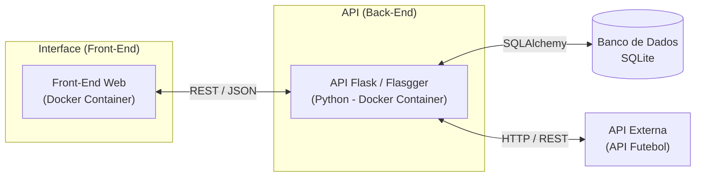

# PUC RIO - Desenvolvimento Back-end Avançado - MVP - E-Futebol API

Este projeto é o MVP da sprint de Desenvolvimento back-end avançado, focado na construção de uma API.

* Foco desta entrega: Desenvolvimento exclusivo da camada de API (Backend), responsável pela persistência de dados, autenticação e regras de negócio, com funcionamento em Docker.
* Integração:
  * Externa - Este componente consomirá uma API externa para obter os dados utilizados na aplicação.
  * Interna - Este componente servirá como base para uma aplicação SPA (Single Page Application), que compõe a segunda parte desta sprint e consumirá os endpoints aqui definidos.

```text
Projeto base: https://github.com/marciocorbolan/puc-rio-sprint-desenvolvimento-full-stack-basico-mvp-api
```

---

## 📋 Funcionalidades

* **Controle de acesso:** Sistema de registro e autenticação de usuário.
* **Gerenciamento de Conteúdo:** Consulta e repasse de dados sobre campeonatos, tabelas de classificação e rodadas via API externa.
* **Documentação:** Swagger (OpenAPI).

---

## 🛠️ Estrutura do Projeto

## 📋 Estrutura



```text
app/
├── app.py                             # Ponto de entrada da aplicação; configura o Flask e registra as rotas
├── config.py                          # Gerenciamento de variáveis de ambiente e configurações globais (ex: SECRET_KEY)
├── database.py                        # Instanciação e configuração da conexão com o banco de dados (SQLAlchemy)
├── error_handlers.py                  # Centralização de tratativas de erros e exceções
├── integrations/                      # Integrações
│   ├── __init__.py
│   └── api_futebol.py                 # Integração com a API externa de dados
├── middlewares/                       # Camada de processamento intermediário
│   ├── __init__.py
│   └── decorators.py                  # Tratativa customizadas (ex: controle de acesso e autenticação JWT)
├── models/                            # Definição das entidades do banco de dados (ORM)
│   ├── __init__.py
│   ├── user_status.py                 # Modelo status do modelo user
│   └── user.py                        # Modelo user
├── routes/                            # Lógica das rotas (controllers)
│   ├── __init__.py
│   ├── auth_routes.py                 # Endpoints de autenticação (registro, login, logout)
│   ├── basic_routes.py                # Endpoints basico (status / home)
│   ├── campeonato_routes.py           # Endpoints das rotas base campeonato
│   └── user_routes.py                 # Endpoints de gerenciamento de perfil do usuário
└── utils/                             # Conjunto de funções auxiliares e lógica de suporte
    ├── __init__.py
    ├── cleanup.py                     # Rotina de limpeza automática de tokens expirados da blacklist
    └── validation.py                  # Lógica de validação de dados de entrada e imagens (Base64)

```

### 📦 Pacotes

* **Web**
  * Flask: Gerencia rotas e processa requisições HTTP;
  * Werkzeug: Base do Flask, lida com a parte técnica de baixo nível do protocolo WSGI. Permite o servidor Python converse com a web;
  * Jinja2: Motor de templates do Flask. Permite gerar conteúdo HTML dinâmico. Dependência essencial do Flask;
  * MarkupSafe: Usada pelo Jinja2 para proteger o código contra ataques de injeção (XSS);

* **Segurança e Comunicação**
  * Flask-CORS: Essencial para APIs que serão consumidas por aplicações hospedadas em origens diferentes. Ele gerencia os cabeçalhos HTTP necessários para permitir requisições Cross-Origin com segurança;
  * PyJWT: Criar, codificar e decodificar tokens JWT (JSON Web Tokens), utilizado na autenticação;
  * itsdangerous: Biblioteca usada pelo Flask para assinar dados de forma segura (essencial para criar tokens de sessão e proteger cookies).
  * Flask-Limiter: Adiciona limites de taxa (rate limiting) às rotas da API. Protege a aplicação contra abusos e ataques de força bruta, limitando a quantidade de requisições por usuário ou IP. (Novo)

* **Documentação**
  * Flasgger: Integra o Swagger UI ao Flask, permitindo a criação da interface interativa e processamento de arquivos .yml.
  * PyYAML: Biblioteca que permite ao Flasgger ler e interpretar o conteúdo dos seus arquivos de documentação YAML.

* **Banco de Dados**
  * SQLAlchemy: O ORM (Object-Relational Mapper). Permite consultas de banco de dados usando classes e objetos;
  * Flask-SQLAlchemy: Uma ponte que integra o SQLAlchemy ao Flask. Facilita configuração da conexão e o gerenciamento da sessões;
  * SQLAlchemy-Utils: Funcionalidades extras do SQLAlchemy (ex: tipos específicos para moedas, e-mails ou senhas);
  * greenlet: Dependência de baixo nível que o SQLAlchemy utiliza para gerenciar tarefas;

* **Utilitários e Infraestrutura**
  * Click: Interfaces de linha de comando para o Flask (ex: flask run);
  * importlib-metadata && zipp: São bibliotecas de utilitários que permitem ao Python ler informações sobre os pacotes instalados no sistema.

### 🧠 Fluxo de Execução Técnica

A API processa requisições através de camadas integradas:
* **Infraestrutura:** O Click inicia a aplicação e o Python gerencia as dependências via importlib-metadata e zipp.
* **Camada Web:** O Werkzeug lida com o protocolo WSGI, o Flask-CORS filtra a origem das requisições e o Flask-Limiter impõe restrições de tráfego, bloqueando requisições excessivas antes do processamento completo. Em seguida, o Flask gerencia a segurança de sessão com itsdangerous e o PyJWT valida a autenticação de usuários via tokens.
* **Camada de Dados:** O Flask-SQLAlchemy utiliza o SQLAlchemy e greenlet para traduzir objetos Python em consultas SQL eficientes.

### ⚙️ Ferramentas de Desenvolvimento
* **Visual Studio Code:** `sudo snap install code --classic`
* **Git:** `sudo apt install git -y`
* **Docker:** `sudo apt update && sudo apt install docker.io -y`

**Nota:** Após instalar o Docker, execute os comando abaixo e reinicie a sessão no terminal para poder rodar comandos Docker sem o sudo.

```bash
sudo usermod -aG docker $USER
newgrp docker
```

---

## 💻 Projeto

### 1. Clonar o repositório
~~~bash
cd ~/
git clone https://github.com/marciocorbolan/puc-rio-sprint-desenvolvimento-back-end-avancado-mvp-api.git
cd puc-rio-sprint-desenvolvimento-back-end-avancado-mvp-api
~~~

### 2. Requisitos básicos

1. **Imagem Docker - Criação:** Constrói a imagem do projeto com todas as dependências (Ação única).
```bash
docker build -t puc-rio-sprint-desenvolvimento-back-end-avancado-mvp-api .
```

2. **Contêiner Docker - Inicialização:** Sempre que fechar/abrir o terminal, será necessário iniciar o ambiente.
```bash
docker run -p 8000:8000 -v $(pwd):/app puc-rio-sprint-desenvolvimento-back-end-avancado-mvp-api
```

### 3. Acesso ao projeto 🚀

Abra o navegador WEB e acesse: http://localhost:8000
Documenteção: http://localhost:8000/apidocs

---

## 👤 Autor
* Márcio Corbolan - Desenvolvedor Principal

---

## 📄 Licença

Este projeto está sob a licença MIT - veja o arquivo [LICENSE](LICENSE) para detalhes.
